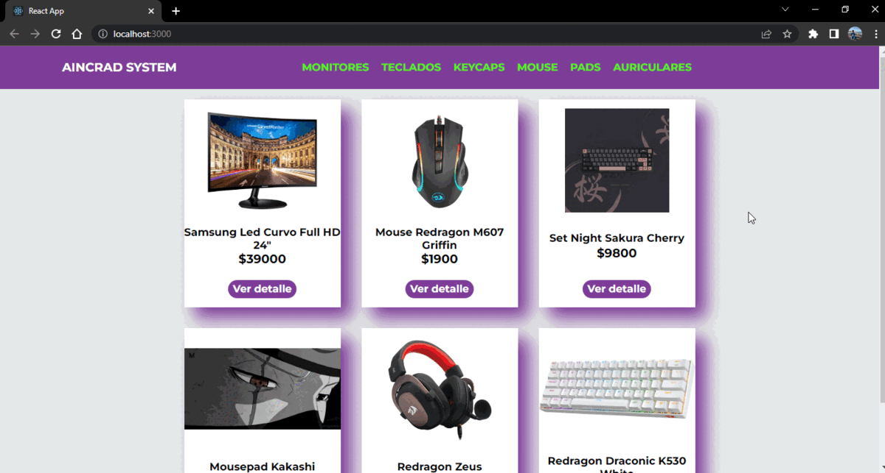

# Ecommerce

## Modelo de comercio online con React y Firebase



## Contenido

- ¿Que es esto?
- Instalación

## ¿Que es esto?

Este repositorio contiene los archivos de una tienda online llevada a cabo mediante la implementación de React y Firebase.
En la ruta principal '/' puedes encontrar la lista de todos los artículos, desde el navbar puedes filtrar por categoría, ruta '/categoryId'. Seleccionando un articulo, accedes a la ruta '/itemId'. Por último la ruta '/cart' muestra los artículos en el carrito y desde ahí puedes confirmar la compra, ruta '/checkout'
Cada artículo cuenta con los campos: nombre, categoría, precio, stock, imagen y descripción. Si un producto no cuenta con stock no se muestra listado.
Cuando una categoría no contiene ningún artículo con stock se muestra un mensaje que lo indica. Por último, al finalizar una compra se muestra un mensaje de confirmación y en caso de error un mensaje de error.

## Instalación

Este proyecto requiere [React](https://es.reactjs.org/) para ser iniciado.

Para iniciarlo de manera local

```sh
$ git clone https://github.com/AugustoC01/ecommerce-CannataFernandez.git
$ cd ecommerce-CannataFernandez
$ npm install
$ npm start
```

## Variables de entorno

See .env.example for an example.

## License

MIT

**Free Software, Hell Yeah!**
